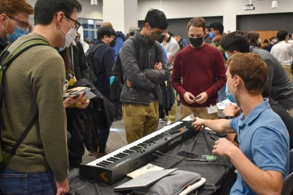
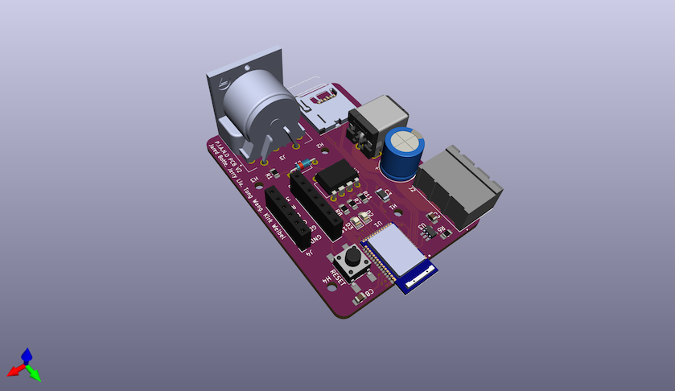
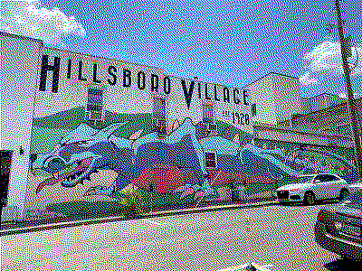
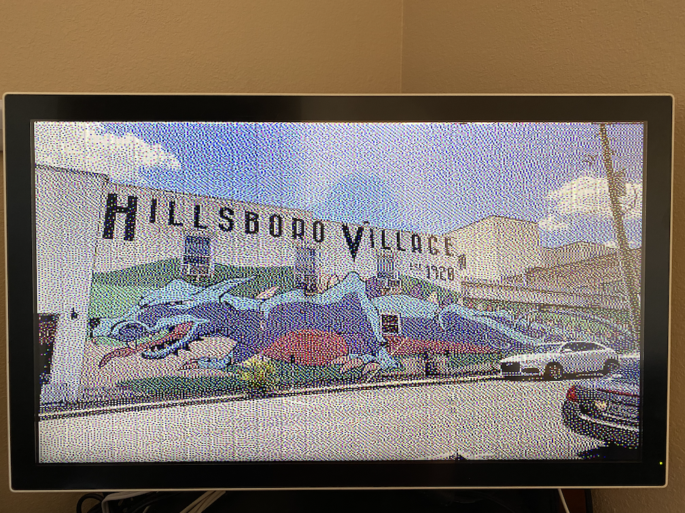

# Welcome to my GitHub profile!

Here you can find information about me as well as some of my projects!

## My programming languages

    
    
    
    
    
    
    
    
    
    
    

## Some of my projects
### PIANO
[jaredbotte/PIANO](https://github.com/jaredbotte/PIANO) contains the code to my senior design project, completed Fall 2021. This was a group project where we went from an idea to a "kickstarter ready" prototype in 1 16-week semester. PIANO stands for Piano Interactive Aid for New Operators, and aims to take a different approach to teaching piano. Traditional approaches typically include using sheet music or other visuals, but our project puts the music right on the keyboard using an individually-addressable LED strip. We are able to process MIDI music files and place the notes on the keyboard in three different modes. 

One mode simply lights up the keys as they are pressed by the user. Another mode plays the song at it's proper tempo by lighting up the keys on the keyboard. User input in this mode is ignored, with the goal of the user being able to keep up with the true cadence of the song. In the final mode, each set of notes is displayed on the keyboard, and it waits for the user to press the correct keys before continuing. By visually providing correct/incorrect key press feedback via lighting up the keys, users can quickly learn any song they want!

This project won 3rd place in Purdue University's Fall 2021 ECESS Spark Challenge [https://www.purdue-ecess.org/spark](https://www.purdue-ecess.org/spark)

|  |
| :----: |
| A group of students learning about our project at the spark challenge. I'm in the red sweater explaining our PCB to a student. Image curtousy of Purdue ECESS |

### PIANO-PCB
[jaredbotte/PIANO-PCB](https://github.com/jaredbotte/PIANO-PCB) contains the KICAD 5.0 files for the PIANO PCB. I created most of the schematic and did all the PCB layout. These PCBs were ordered partway through the semester through [oshpark](https://oshpark.com) and arrived about a week later. PCB population was split between me and one of my teammates, and there was only one footprint issue with the PCB that was easily fixed with a couple flywires.

|  |
| :----: |
| A 3D rendered image of our PCB |

|  |
| :----: |
| Our 3 populated PCBs next to a printout of the components used to verify component footprints |

### asic-fpga-labs
[jaredbotte/asic-fpga-labs](https://github.com/jaredbotte/asic-prototyping-labs)

I am creating these labs as a supplement to Purdue's ECE 337 - ASIC Design Laboratory class. The goal is to bring the simulated modules of ECE 337 into the real world using the Altera DE2-115 development board. I am also using these labs to provide motivation behind some of the hardware implementations created in the class.

There are plans currently in the works to add these labs into ECE 337 and increase the course load from 2 to 3 credit hours. If the repository is private, this is why - we can't just have the solutions floating around! Please reach out to me and I can provide you access or a copy of the repository.

My favorite lab I've created is the custom game controller lab. In this lab, students create a game controller on their breadboard using an 8-bit Parallel-to-Serial Shift register. This is then interpreted using a Serial-to-Parallel Serial Register implementation on the FPGA to create an interface modelled after the NES/SNES controller interface.

### STMVGA
[jaredbotte/STMVGA](https://github.com/jaredbotte/STMVGA)

A VGA driver for the STM32F091 Microcontroller! This project succesfully draws 400x300 images to the screen with a 3-bit color depth. Images are stored in flash memory and displayed to the screen in an 800x600 @ 59 HZ configuration.

|  |  |
| :----: | :----: |
| An example image with 3-bit color depth | That image being drawn by the STM32 |

I am currently in the works of improving the design to be able to generate image data on the fly. It has been quite a challenge working with such little memory, as there's not even enough room for a single frame buffer.
